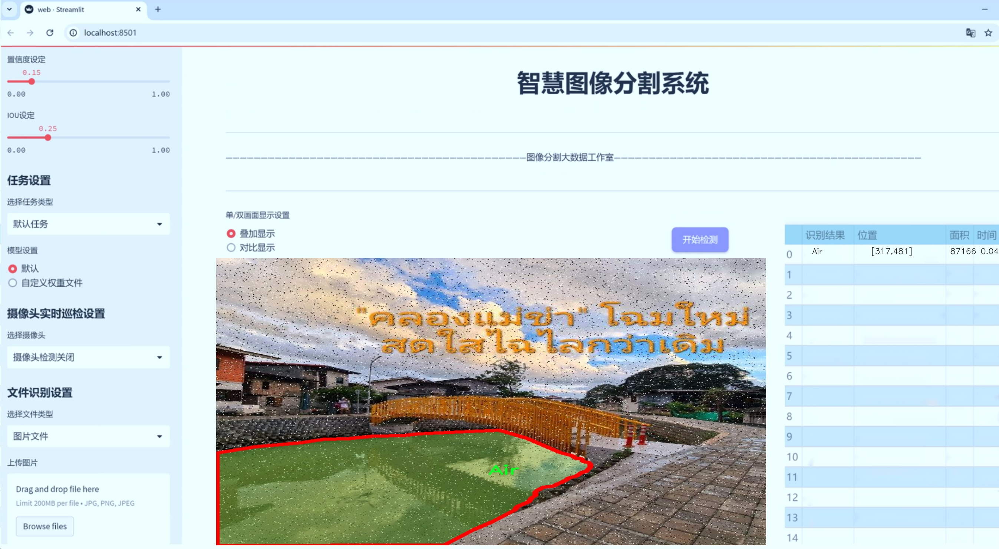
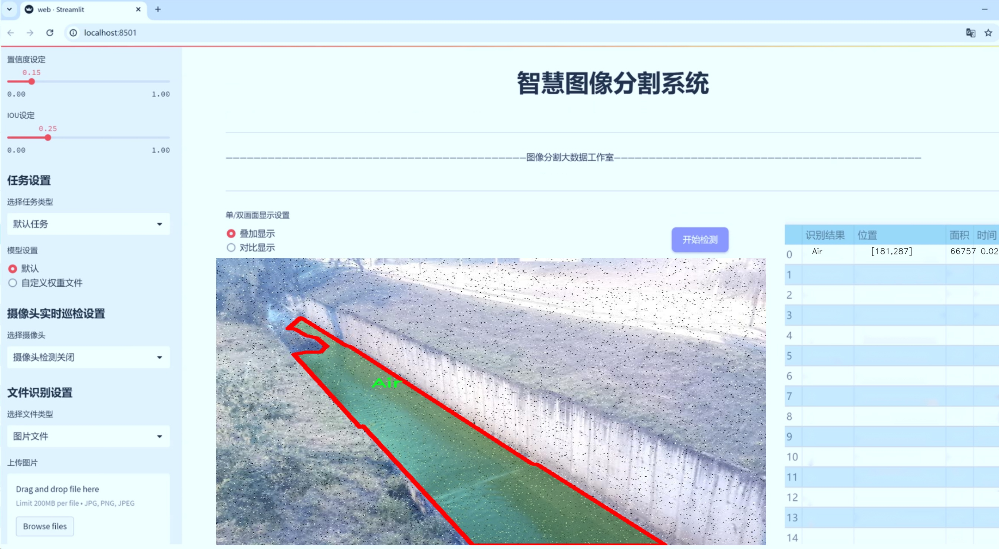
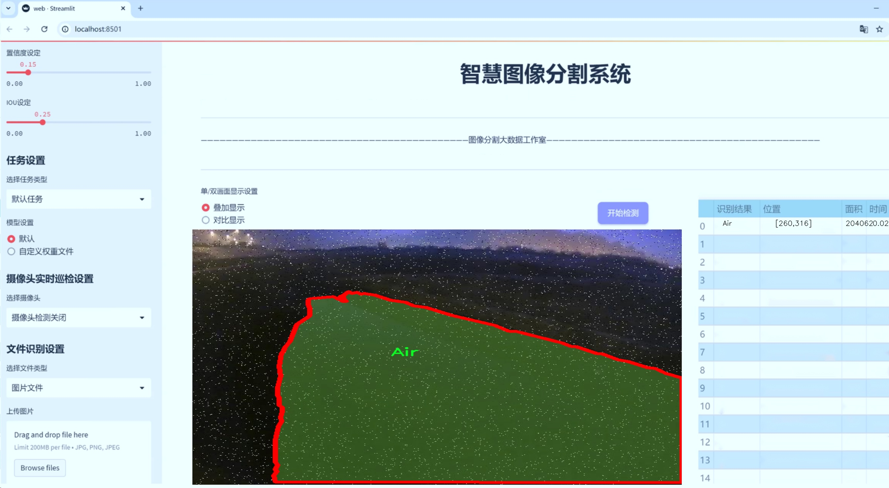
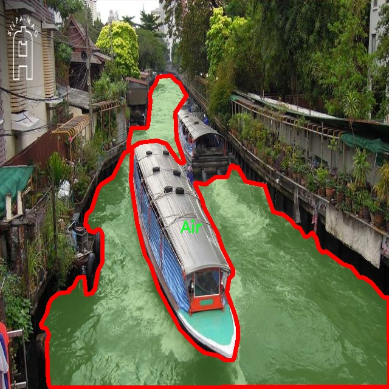
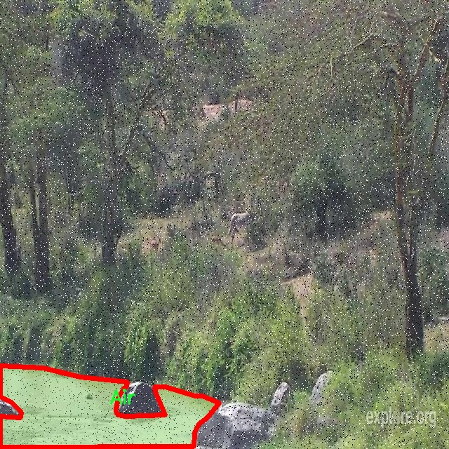
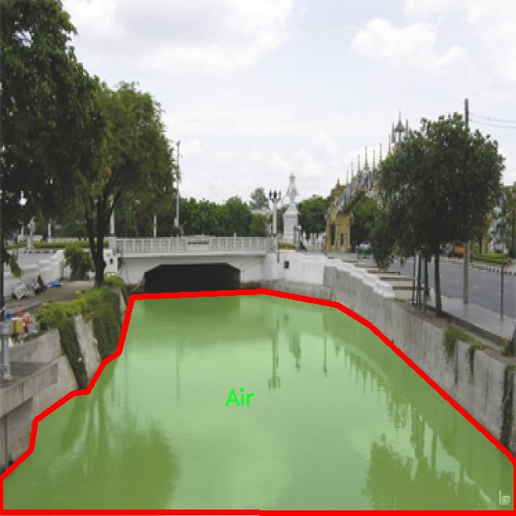

# 液面图像分割系统源码＆数据集分享
 [yolov8-seg-C2f-CloAtt＆yolov8-seg-C2f-MSBlock等50+全套改进创新点发刊_一键训练教程_Web前端展示]

### 1.研究背景与意义

项目参考[ILSVRC ImageNet Large Scale Visual Recognition Challenge](https://gitee.com/YOLOv8_YOLOv11_Segmentation_Studio/projects)

项目来源[AAAI Global Al lnnovation Contest](https://kdocs.cn/l/cszuIiCKVNis)

研究背景与意义

随着计算机视觉技术的迅猛发展，图像分割作为其核心任务之一，逐渐在多个领域中展现出重要的应用价值。尤其是在环境监测、农业管理以及城市规划等领域，液面图像的精确分割对于资源管理和决策支持具有重要意义。近年来，基于深度学习的图像分割方法取得了显著的进展，其中YOLO（You Only Look Once）系列模型因其高效性和实时性而受到广泛关注。YOLOv8作为该系列的最新版本，凭借其改进的网络结构和算法，进一步提升了目标检测和分割的精度和速度。然而，针对液面图像的分割任务，现有的YOLOv8模型仍存在一定的局限性，尤其是在复杂背景和光照变化下的分割效果。因此，基于改进YOLOv8的液面图像分割系统的研究具有重要的学术价值和实际意义。

本研究选用的“air 2”数据集包含3700幅图像，涵盖了两个主要类别：空气（Air）和道路（Jalan）。这一数据集的多样性和丰富性为模型的训练和评估提供了良好的基础。液面图像的分割不仅涉及到液体表面的检测，还需要对背景环境进行有效的区分，这对模型的鲁棒性提出了更高的要求。通过对YOLOv8模型的改进，我们旨在提高其在液面图像分割任务中的表现，特别是在处理不同光照条件和复杂背景时的适应能力。

在实际应用中，液面图像的分割可以广泛应用于水资源管理、污染监测、交通管理等领域。例如，在水质监测中，通过对液面图像的分割，可以有效识别水体中的污染物，进而采取相应的治理措施；在交通管理中，液面图像的分析可以帮助识别道路积水情况，提升行车安全性。因此，开发一个高效的液面图像分割系统，不仅能够推动相关领域的研究进展，还能为实际应用提供技术支持。

此外，基于改进YOLOv8的液面图像分割系统的研究也为深度学习在图像分割领域的应用提供了新的思路。通过对YOLOv8模型的结构优化和算法改进，我们可以探索其在其他复杂场景下的应用潜力。这一研究不仅有助于推动图像分割技术的发展，也为后续的研究提供了可借鉴的经验和方法。

综上所述，基于改进YOLOv8的液面图像分割系统的研究，不仅具有重要的理论意义，也为实际应用提供了广阔的前景。通过对液面图像的精确分割，我们能够更好地理解和管理自然资源，推动可持续发展。因此，本研究的开展将为相关领域的研究者和实践者提供重要的参考和借鉴。

### 2.图片演示







##### 注意：由于此博客编辑较早，上面“2.图片演示”和“3.视频演示”展示的系统图片或者视频可能为老版本，新版本在老版本的基础上升级如下：（实际效果以升级的新版本为准）

  （1）适配了YOLOV8的“目标检测”模型和“实例分割”模型，通过加载相应的权重（.pt）文件即可自适应加载模型。

  （2）支持“图片识别”、“视频识别”、“摄像头实时识别”三种识别模式。

  （3）支持“图片识别”、“视频识别”、“摄像头实时识别”三种识别结果保存导出，解决手动导出（容易卡顿出现爆内存）存在的问题，识别完自动保存结果并导出到tempDir中。

  （4）支持Web前端系统中的标题、背景图等自定义修改，后面提供修改教程。

  另外本项目提供训练的数据集和训练教程,暂不提供权重文件（best.pt）,需要您按照教程进行训练后实现图片演示和Web前端界面演示的效果。

### 3.视频演示

[3.1 视频演示](https://www.bilibili.com/video/BV1M7SbYZE65/)

### 4.数据集信息展示

##### 4.1 本项目数据集详细数据（类别数＆类别名）

nc: 3
names: ['Air', 'Jalan', 'water']


##### 4.2 本项目数据集信息介绍

数据集信息展示

在本研究中，我们使用了名为“air 2”的数据集，以训练和改进YOLOv8-seg的液面图像分割系统。该数据集专注于液体表面及其周围环境的图像，具有重要的应用价值，尤其是在环境监测、资源管理和智能交通等领域。数据集的设计旨在为深度学习模型提供丰富的视觉信息，从而提升其在液面图像分割任务中的表现。

“air 2”数据集包含三种主要类别，分别为“Air”、“Jalan”和“water”。每个类别都代表了特定的视觉特征和背景信息，旨在帮助模型更好地理解和区分不同的环境元素。“Air”类别主要包含与空气相关的图像，可能包括天空、云层以及与气象条件相关的视觉信息。这一类别的图像通常具有较高的透明度和变化多端的色彩，模型需要能够识别这些细微的变化，以便在图像分割过程中准确地将其与其他类别区分开来。

“Jalan”类别则代表了道路或行车道的图像，通常包含路面、交通标志、行人和车辆等元素。这一类别的图像具有复杂的结构和多样的纹理，模型在处理这些图像时，需要具备良好的空间理解能力，以便在液面图像分割中有效地识别出道路的边界和特征。这不仅有助于提升液面图像的分割精度，也为后续的智能交通系统提供了重要的数据支持。

最后，“water”类别专注于水体的图像，包括湖泊、河流、池塘等不同类型的水面。这一类别的图像通常具有丰富的反射和折射特性，模型需要能够识别水面上的波纹、光影变化以及水体与周围环境的交互。这些特征的准确识别对于液面图像分割系统的成功至关重要，因为水体的动态变化常常影响到整体的图像质量和分割效果。

为了确保数据集的多样性和代表性，“air 2”数据集中的图像来源广泛，涵盖了不同的拍摄条件和环境背景。这种多样性不仅增强了模型的泛化能力，也使其在实际应用中能够更好地适应不同的场景。此外，数据集中的每个类别都经过精心标注，确保了训练过程中使用的标签的准确性和一致性。这对于提升YOLOv8-seg模型的训练效果和最终的分割性能至关重要。

综上所述，“air 2”数据集为改进YOLOv8-seg的液面图像分割系统提供了丰富的训练素材。通过对“Air”、“Jalan”和“water”三大类别的深入分析与处理，我们期望能够显著提升模型在液面图像分割任务中的表现，推动相关领域的研究与应用发展。









### 5.全套项目环境部署视频教程（零基础手把手教学）

[5.1 环境部署教程链接（零基础手把手教学）](https://www.bilibili.com/video/BV1jG4Ve4E9t/?vd_source=bc9aec86d164b67a7004b996143742dc)


[5.2 安装Python虚拟环境创建和依赖库安装视频教程链接（零基础手把手教学）](https://www.bilibili.com/video/BV1nA4VeYEze/?vd_source=bc9aec86d164b67a7004b996143742dc)

### 6.手把手YOLOV8-seg训练视频教程（零基础小白有手就能学会）

[6.1 手把手YOLOV8-seg训练视频教程（零基础小白有手就能学会）](https://www.bilibili.com/video/BV1cA4VeYETe/?vd_source=bc9aec86d164b67a7004b996143742dc)


按照上面的训练视频教程链接加载项目提供的数据集，运行train.py即可开始训练



     Epoch   gpu_mem       box       obj       cls    labels  img_size
     1/200     0G   0.01576   0.01955  0.007536        22      1280: 100%|██████████| 849/849 [14:42<00:00,  1.04s/it]
               Class     Images     Labels          P          R     mAP@.5 mAP@.5:.95: 100%|██████████| 213/213 [01:14<00:00,  2.87it/s]
                 all       3395      17314      0.994      0.957      0.0957      0.0843

     Epoch   gpu_mem       box       obj       cls    labels  img_size
     2/200     0G   0.01578   0.01923  0.007006        22      1280: 100%|██████████| 849/849 [14:44<00:00,  1.04s/it]
               Class     Images     Labels          P          R     mAP@.5 mAP@.5:.95: 100%|██████████| 213/213 [01:12<00:00,  2.95it/s]
                 all       3395      17314      0.996      0.956      0.0957      0.0845

     Epoch   gpu_mem       box       obj       cls    labels  img_size
     3/200     0G   0.01561    0.0191  0.006895        27      1280: 100%|██████████| 849/849 [10:56<00:00,  1.29it/s]
               Class     Images     Labels          P          R     mAP@.5 mAP@.5:.95: 100%|███████   | 187/213 [00:52<00:00,  4.04it/s]
                 all       3395      17314      0.996      0.957      0.0957      0.0845


### 7.50+种全套YOLOV8-seg创新点代码加载调参视频教程（一键加载写好的改进模型的配置文件）

[7.1 50+种全套YOLOV8-seg创新点代码加载调参视频教程（一键加载写好的改进模型的配置文件）](https://www.bilibili.com/video/BV1Hw4VePEXv/?vd_source=bc9aec86d164b67a7004b996143742dc)

### 8.YOLOV8-seg图像分割算法原理

原始YOLOv8-seg算法原理

YOLOv8-seg作为YOLO系列中的最新成员，代表了计算机视觉领域在目标检测与实例分割任务中的一项重要进展。自2023年1月10日发布以来，YOLOv8-seg以其卓越的性能和灵活的应用场景，迅速成为研究者和工程师们关注的焦点。该模型不仅在精度和执行时间上超越了前代模型，还通过引入一系列创新技术，进一步提升了目标检测和分割的能力。

YOLOv8-seg的架构主要由输入层、主干网络（Backbone）、颈部网络（Neck）和头部网络（Head）构成。输入层负责对图像进行预处理，确保其符合模型的输入要求。接下来，主干网络采用了改进的CSPDarknet结构，利用卷积操作对输入图像进行特征提取。与YOLOv5相比，YOLOv8-seg引入了C2f模块，替代了传统的C3模块。这一变化不仅增强了特征提取的能力，还通过引入更多的跳层连接和分支结构，促进了信息的流动和梯度的传播，从而提升了模型的学习效率。

在特征提取过程中，YOLOv8-seg通过快速空间金字塔池化（SPPF）模块，有效地处理多尺度特征。这一模块的设计使得模型能够在保持较低计算复杂度的同时，提取到丰富的特征信息，适应不同尺寸和比例的目标。这种多尺度特征的融合为后续的目标检测和实例分割提供了坚实的基础。

颈部网络则采用了特征金字塔网络（FPN）和路径聚合网络（PAN）的结合，通过多个卷积层和池化层，对提取到的特征图进行进一步处理和压缩。这一结构的设计理念在于有效地融合来自不同尺度的特征信息，使得模型能够更好地理解图像中的上下文信息，提升目标检测的准确性和鲁棒性。

YOLOv8-seg的一个显著创新在于其解耦的检测头。与传统的锚框（Anchor-Based）检测方法不同，YOLOv8-seg采用了无锚框（Anchor-Free）的检测策略。这一策略直接预测目标的中心点和宽高比，显著减少了锚框的数量，进而提高了检测速度和准确度。解耦的设计使得模型在分类和回归任务中能够独立优化，避免了传统方法中存在的耦合问题，从而提升了整体性能。

此外，YOLOv8-seg在损失函数的设计上也进行了创新，旨在更好地适应目标检测和实例分割的需求。通过对损失函数的优化，模型能够在训练过程中更有效地学习到目标的特征，从而提高分割精度和检测效果。这一系列的改进，使得YOLOv8-seg在处理复杂场景时，能够更好地应对小目标检测和高分辨率图像的挑战。

在实际应用中，YOLOv8-seg的灵活性和高效性使其适用于各种任务，包括但不限于自动驾驶、安防监控、医疗影像分析等领域。其优越的性能不仅体现在准确率上，更在于其在不同硬件平台上的兼容性，能够在CPU和GPU等多种环境中高效运行。这一特性使得YOLOv8-seg在实际应用中具备了广泛的适用性，能够满足不同用户的需求。

综上所述，YOLOv8-seg通过一系列的创新和改进，成功地将目标检测与实例分割的性能提升到了一个新的高度。其独特的网络结构设计、解耦的检测头以及优化的损失函数，使得该模型在计算机视觉领域中占据了重要的地位。随着技术的不断进步，YOLOv8-seg无疑将在未来的研究和应用中发挥更大的作用，推动计算机视觉技术的进一步发展。


### 9.系统功能展示（检测对象为举例，实际内容以本项目数据集为准）

图9.1.系统支持检测结果表格显示

  图9.2.系统支持置信度和IOU阈值手动调节

  图9.3.系统支持自定义加载权重文件best.pt(需要你通过步骤5中训练获得)

  图9.4.系统支持摄像头实时识别

  图9.5.系统支持图片识别

  图9.6.系统支持视频识别

  图9.7.系统支持识别结果文件自动保存

  图9.8.系统支持Excel导出检测结果数据


### 10.50+种全套YOLOV8-seg创新点原理讲解（非科班也可以轻松写刊发刊，V11版本正在科研待更新）

#### 10.1 由于篇幅限制，每个创新点的具体原理讲解就不一一展开，具体见下列网址中的创新点对应子项目的技术原理博客网址【Blog】：


[10.1 50+种全套YOLOV8-seg创新点原理讲解链接](https://gitee.com/qunmasj/good)

#### 10.2 部分改进模块原理讲解(完整的改进原理见上图和技术博客链接)【如果此小节的图加载失败可以通过CSDN或者Github搜索该博客的标题访问原始博客，原始博客图片显示正常】

### YOLOv8简介

按照官方描述，YOLOv8 是一个 SOTA 模型，它建立在以前 YOLO 版本的成功基础上，并引入了新的功能和改进，以进一步提升性能和灵活性。具体创新包括一个新的骨干网络、一个新的 Ancher-Free 检测头和一个新的损失函数，可以在从 CPU 到 GPU 的各种硬件平台上运行。

不过 ultralytics 并没有直接将开源库命名为 YOLOv8，而是直接使用 ultralytics 这个词，原因是 ultralytics 将这个库定位为算法框架，而非某一个特定算法，一个主要特点是可扩展性。其希望这个库不仅仅能够用于 YOLO 系列模型，而是能够支持非 YOLO 模型以及分类分割姿态估计等各类任务。
总而言之，ultralytics 开源库的两个主要优点是：

融合众多当前 SOTA 技术于一体
未来将支持其他 YOLO 系列以及 YOLO 之外的更多算法


下表为官方在 COCO Val 2017 数据集上测试的 mAP、参数量和 FLOPs 结果。可以看出 YOLOv8 相比 YOLOv5 精度提升非常多，但是 N/S/M 模型相应的参数量和 FLOPs 都增加了不少，从上图也可以看出相比 YOLOV5 大部分模型推理速度变慢了。


额外提一句，现在各个 YOLO 系列改进算法都在 COCO 上面有明显性能提升，但是在自定义数据集上面的泛化性还没有得到广泛验证，至今依然听到不少关于 YOLOv5 泛化性能较优异的说法。对各系列 YOLO 泛化性验证也是 MMYOLO 中一个特别关心和重点发力的方向。

### YOLO-MS简介
实时目标检测，以YOLO系列为例，已在工业领域中找到重要应用，特别是在边缘设备（如无人机和机器人）中。与之前的目标检测器不同，实时目标检测器旨在在速度和准确性之间追求最佳平衡。为了实现这一目标，提出了大量的工作：从第一代DarkNet到CSPNet，再到最近的扩展ELAN，随着性能的快速增长，实时目标检测器的架构经历了巨大的变化。

尽管性能令人印象深刻，但在不同尺度上识别对象仍然是实时目标检测器面临的基本挑战。这促使作者设计了一个强大的编码器架构，用于学习具有表现力的多尺度特征表示。具体而言，作者从两个新的角度考虑为实时目标检测编码多尺度特征：

从局部视角出发，作者设计了一个具有简单而有效的分层特征融合策略的MS-Block。受到Res2Net的启发，作者在MS-Block中引入了多个分支来进行特征提取，但不同的是，作者使用了一个带有深度卷积的 Inverted Bottleneck Block块，以实现对大Kernel的高效利用。

从全局视角出发，作者提出随着网络加深逐渐增加卷积的Kernel-Size。作者在浅层使用小Kernel卷积来更高效地处理高分辨率特征。另一方面，在深层中，作者采用大Kernel卷积来捕捉广泛的信息。

基于以上设计原则，作者呈现了作者的实时目标检测器，称为YOLO-MS。为了评估作者的YOLO-MS的性能，作者在MS COCO数据集上进行了全面的实验。还提供了与其他最先进方法的定量比较，以展示作者方法的强大性能。如图1所示，YOLO-MS在计算性能平衡方面优于其他近期的实时目标检测器。


具体而言，YOLO-MS-XS在MS COCO上获得了43%+的AP得分，仅具有450万个可学习参数和8.7亿个FLOPs。YOLO-MS-S和YOLO-MS分别获得了46%+和51%+的AP，可学习参数分别为810万和2220万。此外，作者的工作还可以作为其他YOLO模型的即插即用模块。通常情况下，作者的方法可以将YOLOv8的AP从37%+显著提高到40%+，甚至还可以使用更少的参数和FLOPs。


#### Multi-Scale Building Block Design
CSP Block是一个基于阶段级梯度路径的网络，平衡了梯度组合和计算成本。它是广泛应用于YOLO系列的基本构建块。已经提出了几种变体，包括YOLOv4和YOLOv5中的原始版本，Scaled YOLOv4中的CSPVoVNet，YOLOv7中的ELAN，以及RTMDet中提出的大Kernel单元。作者在图2(a)和图2(b)中分别展示了原始CSP块和ELAN的结构。


上述实时检测器中被忽视的一个关键方面是如何在基本构建块中编码多尺度特征。其中一个强大的设计原则是Res2Net，它聚合了来自不同层次的特征以增强多尺度表示。然而，这一原则并没有充分探索大Kernel卷积的作用，而大Kernel卷积已经在基于CNN的视觉识别任务模型中证明有效。将大Kernel卷积纳入Res2Net的主要障碍在于它们引入的计算开销，因为构建块采用了标准卷积。在作者的方法中，作者提出用 Inverted Bottleneck Block替代标准的3 × 3卷积，以享受大Kernel卷积的好处。

基于前面的分析，作者提出了一个带有分层特征融合策略的全新Block，称为MS-Block，以增强实时目标检测器在提取多尺度特征时的能力，同时保持快速的推理速度。

MS-Block的具体结构如图2(c)所示。假设是输入特征。通过1×1卷积的转换后，X的通道维度增加到n*C。然后，作者将X分割成n个不同的组，表示为，其中。为了降低计算成本，作者选择n为3。

注意，除了之外，每个其他组都经过一个 Inverted Bottleneck Block层，用表示，其中k表示Kernel-Size，以获得。的数学表示如下：


根据这个公式，该博客的作者不将 Inverted Bottleneck Block层连接，使其作为跨阶段连接，并保留来自前面层的信息。最后，作者将所有分割连接在一起，并应用1×1卷积来在所有分割之间进行交互，每个分割都编码不同尺度的特征。当网络加深时，这个1×1卷积也用于调整通道数。

#### Heterogeneous Kernel Selection Protocol
除了构建块的设计外，作者还从宏观角度探讨了卷积的使用。之前的实时目标检测器在不同的编码器阶段采用了同质卷积（即具有相同Kernel-Size的卷积），但作者认为这不是提取多尺度语义信息的最佳选项。

在金字塔结构中，从检测器的浅阶段提取的高分辨率特征通常用于捕捉细粒度语义，将用于检测小目标。相反，来自网络较深阶段的低分辨率特征用于捕捉高级语义，将用于检测大目标。如果作者在所有阶段都采用统一的小Kernel卷积，深阶段的有效感受野（ERF）将受到限制，影响大目标的性能。在每个阶段中引入大Kernel卷积可以帮助解决这个问题。然而，具有大的ERF的大Kernel可以编码更广泛的区域，这增加了在小目标外部包含噪声信息的概率，并且降低了推理速度。

在这项工作中，作者建议在不同阶段中采用异构卷积，以帮助捕获更丰富的多尺度特征。具体来说，在编码器的第一个阶段中，作者采用最小Kernel卷积，而最大Kernel卷积位于最后一个阶段。随后，作者逐步增加中间阶段的Kernel-Size，使其与特征分辨率的增加保持一致。这种策略允许提取细粒度和粗粒度的语义信息，增强了编码器的多尺度特征表示能力。

正如图所示，作者将k的值分别分配给编码器中的浅阶段到深阶段，取值为3、5、7和9。作者将其称为异构Kernel选择（HKS）协议。


作者的HKS协议能够在深层中扩大感受野，而不会对浅层产生任何其他影响。此外，HKS不仅有助于编码更丰富的多尺度特征，还确保了高效的推理。

如表1所示，将大Kernel卷积应用于高分辨率特征会产生较高的计算开销。然而，作者的HKS协议在低分辨率特征上采用大Kernel卷积，从而与仅使用大Kernel卷积相比，大大降低了计算成本。


在实践中，作者经验性地发现，采用HKS协议的YOLO-MS的推理速度几乎与仅使用深度可分离的3 × 3卷积相同。

#### Architecture
如图所示，作者模型的Backbone由4个阶段组成，每个阶段后面跟随1个步长为2的3 × 3卷积进行下采样。在第3个阶段后，作者添加了1个SPP块，与RTMDet中一样。在作者的编码器上，作者使用PAFPN作为Neck来构建特征金字塔[31, 35]。它融合了从Backbone不同阶段提取的多尺度特征。Neck中使用的基本构建块也是作者的MS-Block，在其中使用3 × 3深度可分离卷积进行快速推理。

此外，为了在速度和准确性之间取得更好的平衡，作者将Backbone中多级特征的通道深度减半。作者提供了3个不同尺度的YOLO-MS变体，即YOLO-MS-XS、YOLO-MS-S和YOLO-MS。不同尺度的YOLO-MS的详细配置列在表2中。对于YOLO-MS的其他部分，作者将其保持与RTMDet相同。


### 11.项目核心源码讲解（再也不用担心看不懂代码逻辑）

#### 11.1 ultralytics\models\yolo\detect\val.py

以下是经过精简和注释的核心代码部分，主要保留了与YOLO模型检测验证相关的功能和逻辑：

```python
import os
import torch
from ultralytics.engine.validator import BaseValidator
from ultralytics.utils import LOGGER, ops
from ultralytics.utils.metrics import ConfusionMatrix, DetMetrics, box_iou

class DetectionValidator(BaseValidator):
    """
    扩展自BaseValidator类的检测验证器，用于基于检测模型的验证。
    """

    def __init__(self, dataloader=None, save_dir=None, args=None):
        """初始化检测模型，设置必要的变量和参数。"""
        super().__init__(dataloader, save_dir, args)
        self.metrics = DetMetrics(save_dir=self.save_dir)  # 初始化检测指标
        self.iouv = torch.linspace(0.5, 0.95, 10)  # IoU向量，用于计算mAP@0.5:0.95

    def preprocess(self, batch):
        """对YOLO训练的图像批次进行预处理。"""
        batch['img'] = batch['img'].to(self.device, non_blocking=True)  # 将图像转移到设备
        batch['img'] = batch['img'].float() / 255  # 归一化图像
        for k in ['batch_idx', 'cls', 'bboxes']:
            batch[k] = batch[k].to(self.device)  # 将其他数据转移到设备
        return batch

    def postprocess(self, preds):
        """对预测输出应用非极大值抑制（NMS）。"""
        return ops.non_max_suppression(preds, self.args.conf, self.args.iou)

    def update_metrics(self, preds, batch):
        """更新检测指标。"""
        for si, pred in enumerate(preds):
            idx = batch['batch_idx'] == si
            cls = batch['cls'][idx]  # 获取当前批次的类别
            bbox = batch['bboxes'][idx]  # 获取当前批次的边界框
            npr = pred.shape[0]  # 预测数量

            if npr == 0:  # 如果没有预测
                continue

            # 处理预测框
            predn = pred.clone()  # 克隆预测
            ops.scale_boxes(batch['img'][si].shape[1:], predn[:, :4], batch['ori_shape'][si])  # 转换为原始空间坐标

            # 计算IoU并更新指标
            if cls.shape[0] > 0:
                correct_bboxes = self._process_batch(predn, torch.cat((cls, bbox), 1))  # 处理当前批次
            self.stats.append((correct_bboxes, pred[:, 4], pred[:, 5], cls.squeeze(-1)))  # 记录统计信息

    def _process_batch(self, detections, labels):
        """
        返回正确的预测矩阵。

        参数:
            detections (torch.Tensor): 形状为[N, 6]的检测张量。
            labels (torch.Tensor): 形状为[M, 5]的标签张量。

        返回:
            (torch.Tensor): 形状为[N, 10]的正确预测矩阵，表示10个IoU水平。
        """
        iou = box_iou(labels[:, 1:], detections[:, :4])  # 计算IoU
        return self.match_predictions(detections[:, 5], labels[:, 0], iou)  # 匹配预测与标签

    def get_stats(self):
        """返回指标统计信息和结果字典。"""
        stats = [torch.cat(x, 0).cpu().numpy() for x in zip(*self.stats)]  # 转换为numpy数组
        if len(stats) and stats[0].any():
            self.metrics.process(*stats)  # 处理指标
        return self.metrics.results_dict  # 返回结果字典

    def print_results(self):
        """打印每个类别的训练/验证集指标。"""
        pf = '%22s' + '%11i' * 2 + '%11.3g' * len(self.metrics.keys)  # 打印格式
        LOGGER.info(pf % ('all', self.seen, self.nt_per_class.sum(), *self.metrics.mean_results()))  # 打印总体结果
```

### 代码注释说明
1. **DetectionValidator类**: 该类用于验证YOLO模型的检测性能，继承自`BaseValidator`。
2. **__init__方法**: 初始化类时设置检测指标和IoU向量。
3. **preprocess方法**: 对输入的图像批次进行预处理，包括将图像转移到设备并进行归一化。
4. **postprocess方法**: 对模型的预测结果应用非极大值抑制，去除冗余的边界框。
5. **update_metrics方法**: 更新当前批次的检测指标，计算预测框与真实框的匹配情况。
6. **_process_batch方法**: 计算IoU并返回正确的预测矩阵。
7. **get_stats方法**: 收集并返回检测结果的统计信息。
8. **print_results方法**: 打印每个类别的检测结果和总体性能指标。

以上代码和注释提供了YOLO检测验证的核心逻辑，便于理解和使用。

这个文件是Ultralytics YOLO模型的一个验证器类，主要用于目标检测任务的验证。文件中定义了一个名为`DetectionValidator`的类，继承自`BaseValidator`，并实现了一系列方法来处理验证过程中的数据预处理、指标计算、结果输出等功能。

在初始化方法`__init__`中，类会接收一些参数，如数据加载器、保存目录、进度条、参数设置等，并初始化一些必要的变量。这里包括设置任务类型为检测、初始化检测指标、计算IoU（Intersection over Union）等。

`preprocess`方法用于对输入的图像批次进行预处理，包括将图像数据转移到指定设备（如GPU），进行数据类型转换和归一化处理。它还会根据需要生成用于自动标注的标签。

`init_metrics`方法则用于初始化评估指标，包括检查数据集是否为COCO格式，设置类别映射，初始化混淆矩阵等。

在`get_desc`方法中，返回一个格式化的字符串，用于描述YOLO模型的类别指标。

`postprocess`方法应用非极大值抑制（NMS）来处理模型的预测输出，以减少冗余的边界框。

`update_metrics`方法用于更新验证过程中计算的指标。它会遍历每个预测结果，并与真实标签进行比较，计算正确的边界框，并更新混淆矩阵和其他统计信息。

`finalize_metrics`方法用于设置最终的指标值，包括速度和混淆矩阵。

`get_stats`方法返回指标统计信息和结果字典，统计每个类别的目标数量。

`print_results`方法则负责打印训练或验证集的每个类别的指标结果，并在需要时绘制混淆矩阵。

`_process_batch`方法用于处理每个批次的检测结果，计算IoU并返回正确预测的矩阵。

`build_dataset`和`get_dataloader`方法用于构建YOLO数据集和返回数据加载器，支持不同的批次大小和模式（训练或验证）。

`plot_val_samples`和`plot_predictions`方法用于绘制验证样本和预测结果，并将其保存为图像文件。

`save_one_txt`方法将YOLO检测结果保存为文本文件，格式为归一化坐标。

`pred_to_json`方法将YOLO的预测结果序列化为COCO格式的JSON文件，方便后续评估。

`eval_json`方法用于评估YOLO输出的JSON格式结果，并返回性能统计信息，支持使用pycocotools库计算mAP（mean Average Precision）。

整体而言，这个文件实现了YOLO模型在目标检测任务中的验证流程，包括数据预处理、指标计算、结果输出等功能，能够帮助用户评估模型的性能。

#### 11.2 ultralytics\models\yolo\pose\__init__.py

以下是保留的核心代码部分，并附上详细的中文注释：

```python
# 导入所需的模块
from .predict import PosePredictor  # 导入姿态预测器
from .train import PoseTrainer      # 导入姿态训练器
from .val import PoseValidator      # 导入姿态验证器

# 定义模块的公开接口
__all__ = 'PoseTrainer', 'PoseValidator', 'PosePredictor'  # 指定在使用 'from module import *' 时可导入的类
```

### 代码注释说明：
1. **导入模块**：
   - `from .predict import PosePredictor`：从当前包的 `predict` 模块中导入 `PosePredictor` 类，用于姿态预测。
   - `from .train import PoseTrainer`：从当前包的 `train` 模块中导入 `PoseTrainer` 类，用于训练模型。
   - `from .val import PoseValidator`：从当前包的 `val` 模块中导入 `PoseValidator` 类，用于验证模型的性能。

2. **定义公开接口**：
   - `__all__` 是一个特殊变量，用于定义当使用 `from module import *` 时，哪些类或函数是可以被导入的。在这里，指定了 `PoseTrainer`、`PoseValidator` 和 `PosePredictor` 三个类为模块的公开接口，方便用户使用。

这个程序文件是Ultralytics YOLO项目中的一个模块，主要用于姿态估计（Pose Estimation）。文件名为`__init__.py`，它的主要作用是将当前目录标识为一个Python包，并定义该包的公共接口。

在文件中，首先有一个注释，表明该项目是Ultralytics YOLO的一部分，并且遵循AGPL-3.0许可证。接下来，文件通过相对导入的方式引入了三个类：`PosePredictor`、`PoseTrainer`和`PoseValidator`。这些类分别负责姿态预测、模型训练和模型验证的功能。

最后，`__all__`变量被定义为一个元组，包含了这三个类的名称。这意味着当使用`from ultralytics.models.yolo.pose import *`这样的语句时，只会导入`PoseTrainer`、`PoseValidator`和`PosePredictor`这三个类，从而控制了模块的公共接口，避免不必要的命名冲突或隐藏实现细节。

总的来说，这个文件是Ultralytics YOLO姿态估计模块的初始化文件，负责导入和暴露该模块的主要功能。

#### 11.3 ultralytics\nn\extra_modules\ops_dcnv3\modules\__init__.py

以下是保留的核心代码部分，并附上详细的中文注释：

```python
# 导入所需的模块
from .dcnv3 import DCNv3, DCNv3_pytorch, DCNv3_DyHead

# 以上代码从当前包的 dcnv3 模块中导入了三个类或函数：
# 1. DCNv3：可能是一个深度可分离卷积的实现，通常用于提高模型的性能和效率。
# 2. DCNv3_pytorch：可能是 DCNv3 在 PyTorch 框架下的实现，便于在 PyTorch 中使用。
# 3. DCNv3_DyHead：可能是一个动态头部的实现，通常用于目标检测等任务中，提供灵活的输出结构。
```

这段代码的核心在于导入自定义的深度学习模块，具体实现可能涉及到卷积神经网络的优化和目标检测等任务。

这个程序文件是一个Python模块的初始化文件，位于`ultralytics/nn/extra_modules/ops_dcnv3/modules/`目录下。文件的开头包含了一些版权信息，表明该代码属于OpenGVLab，并且是根据MIT许可证进行授权的。这意味着用户可以自由使用、修改和分发该代码，只要遵循许可证的条款。

在文件的主体部分，使用了`from ... import ...`语句从同一目录下的`dcnv3`模块中导入了三个类或函数：`DCNv3`、`DCNv3_pytorch`和`DCNv3_DyHead`。这些导入的内容可能是与深度学习相关的操作，尤其是在处理卷积神经网络时，DCNv3可能指的是一种特定的可变形卷积网络（Deformable Convolutional Network）实现。

通过这个初始化文件，用户在导入`ultralytics.nn.extra_modules.ops_dcnv3.modules`模块时，可以直接使用`DCNv3`、`DCNv3_pytorch`和`DCNv3_DyHead`这三个组件，而不需要单独去导入`dcnv3`模块。这种做法提高了代码的可读性和使用的便利性。

#### 11.4 ultralytics\nn\__init__.py

```python
# 导入所需的模型和函数
from .tasks import (BaseModel, ClassificationModel, DetectionModel, SegmentationModel, 
                    attempt_load_one_weight, attempt_load_weights, guess_model_scale, 
                    guess_model_task, parse_model, torch_safe_load, yaml_model_load)

# 定义模块的公开接口，允许外部使用的类和函数
__all__ = (
    'attempt_load_one_weight',  # 尝试加载单个权重文件的函数
    'attempt_load_weights',      # 尝试加载多个权重文件的函数
    'parse_model',              # 解析模型结构的函数
    'yaml_model_load',          # 从YAML文件加载模型配置的函数
    'guess_model_task',         # 猜测模型任务类型的函数
    'guess_model_scale',        # 猜测模型缩放比例的函数
    'torch_safe_load',          # 安全加载PyTorch模型的函数
    'DetectionModel',           # 检测模型类
    'SegmentationModel',        # 分割模型类
    'ClassificationModel',      # 分类模型类
    'BaseModel'                 # 基础模型类
)
```

### 代码注释说明：
1. **导入模块**：代码从当前包的 `tasks` 模块中导入了多个模型类和函数，这些是实现不同功能（如分类、检测、分割等）的核心组件。
2. **`__all__` 列表**：这个特殊变量定义了当使用 `from module import *` 时，哪些名称会被导入。它帮助用户了解模块的公共接口，确保只暴露必要的功能，增强模块的封装性和可维护性。

这个程序文件是Ultralytics YOLO（You Only Look Once）项目的一部分，使用了AGPL-3.0许可证。文件的主要功能是导入与模型相关的类和函数，并定义了一个公共接口。

首先，文件通过相对导入的方式引入了多个模块和函数，这些模块和函数分别用于处理不同类型的模型任务，包括基础模型（BaseModel）、分类模型（ClassificationModel）、检测模型（DetectionModel）和分割模型（SegmentationModel）。此外，还引入了一些辅助函数，例如尝试加载权重（attempt_load_one_weight和attempt_load_weights）、猜测模型规模（guess_model_scale）、猜测模型任务（guess_model_task）、解析模型（parse_model）、安全加载Torch模型（torch_safe_load）以及从YAML文件加载模型（yaml_model_load）。

接下来，文件使用`__all__`变量定义了一个公共接口，列出了可以被外部访问的模块和函数。这意味着，当其他模块使用`from ultralytics.nn import *`时，只会导入`__all__`中列出的内容。这种做法有助于控制模块的可见性，确保外部用户只访问到必要的功能，从而提高代码的封装性和可维护性。

总的来说，这个文件是Ultralytics YOLO库的一个初始化模块，负责组织和导出与模型相关的功能，使得用户可以方便地使用这些功能进行模型的加载和处理。

#### 11.5 ultralytics\models\sam\model.py

以下是代码中最核心的部分，并附上详细的中文注释：

```python
from pathlib import Path
from ultralytics.engine.model import Model
from .build import build_sam
from .predict import Predictor

class SAM(Model):
    """
    SAM (Segment Anything Model) 接口类。

    SAM 旨在进行可提示的实时图像分割。可以使用多种提示方式，如边界框、点或标签。该模型具有零-shot 性能，并在 SA-1B 数据集上进行训练。
    """

    def __init__(self, model='sam_b.pt') -> None:
        """
        使用预训练模型文件初始化 SAM 模型。

        参数:
            model (str): 预训练 SAM 模型文件的路径。文件应具有 .pt 或 .pth 扩展名。

        异常:
            NotImplementedError: 如果模型文件扩展名不是 .pt 或 .pth。
        """
        # 检查模型文件的扩展名是否有效
        if model and Path(model).suffix not in ('.pt', '.pth'):
            raise NotImplementedError('SAM 预测需要预训练的 *.pt 或 *.pth 模型。')
        # 调用父类构造函数，初始化模型
        super().__init__(model=model, task='segment')

    def predict(self, source, stream=False, bboxes=None, points=None, labels=None, **kwargs):
        """
        对给定的图像或视频源执行分割预测。

        参数:
            source (str): 图像或视频文件的路径，或 PIL.Image 对象，或 numpy.ndarray 对象。
            stream (bool, optional): 如果为 True，则启用实时流式处理。默认为 False。
            bboxes (list, optional): 用于提示分割的边界框坐标列表。默认为 None。
            points (list, optional): 用于提示分割的点列表。默认为 None。
            labels (list, optional): 用于提示分割的标签列表。默认为 None。

        返回:
            (list): 模型的预测结果。
        """
        # 设置预测的默认参数
        overrides = dict(conf=0.25, task='segment', mode='predict', imgsz=1024)
        kwargs.update(overrides)  # 更新传入的参数
        prompts = dict(bboxes=bboxes, points=points, labels=labels)  # 收集提示信息
        # 调用父类的预测方法并返回结果
        return super().predict(source, stream, prompts=prompts, **kwargs)

    def info(self, detailed=False, verbose=True):
        """
        记录有关 SAM 模型的信息。

        参数:
            detailed (bool, optional): 如果为 True，则显示有关模型的详细信息。默认为 False。
            verbose (bool, optional): 如果为 True，则在控制台上显示信息。默认为 True。

        返回:
            (tuple): 包含模型信息的元组。
        """
        return model_info(self.model, detailed=detailed, verbose=verbose)

    @property
    def task_map(self):
        """
        提供从 'segment' 任务到其对应的 'Predictor' 的映射。

        返回:
            (dict): 将 'segment' 任务映射到其对应的 'Predictor' 的字典。
        """
        return {'segment': {'predictor': Predictor}}
```

### 代码核心部分解释：
1. **SAM 类**：这是一个继承自 `Model` 的类，专门用于实现可提示的实时图像分割功能。
2. **初始化方法**：构造函数接受一个模型文件路径，并检查文件扩展名是否合法（只能是 `.pt` 或 `.pth`）。
3. **预测方法**：`predict` 方法用于对输入的图像或视频进行分割预测，支持多种提示方式（边界框、点、标签）。
4. **信息方法**：`info` 方法用于获取和记录模型的相关信息。
5. **任务映射**：`task_map` 属性提供了任务与预测器之间的映射关系。

这个程序文件是Ultralytics公司开发的SAM（Segment Anything Model）模型的接口实现，主要用于实时图像分割任务。SAM模型具备极高的灵活性，能够进行可提示的分割，并且在SA-1B数据集上进行了训练，具有零-shot性能，能够适应新的图像分布和任务，而无需事先的知识。

文件首先导入了一些必要的模块，包括路径处理、模型基类和工具函数。然后定义了一个名为`SAM`的类，该类继承自`Model`，并提供了对SAM模型的接口。

在`__init__`方法中，初始化SAM模型时需要提供一个预训练模型文件的路径，该文件必须以`.pt`或`.pth`为后缀。如果提供的文件不符合要求，则会抛出`NotImplementedError`异常。初始化时调用了父类的构造函数，并指定任务为“分割”。

`_load`方法用于加载指定的权重文件到SAM模型中，接收权重文件的路径和可选的任务名称作为参数。

`predict`方法用于对给定的图像或视频源进行分割预测。它接收多个参数，包括源文件路径、是否启用实时流、以及用于提示分割的边界框、点和标签等。该方法会构建一个包含默认参数的字典，并将提示信息传递给父类的`predict`方法，最终返回模型的预测结果。

`__call__`方法是`predict`方法的别名，允许用户以更简洁的方式调用预测功能。

`info`方法用于记录关于SAM模型的信息，可以选择是否显示详细信息和控制台输出。

最后，`task_map`属性提供了一个字典，将“分割”任务映射到其对应的`Predictor`，以便于在执行分割任务时进行管理和调用。

整体来看，这个文件实现了SAM模型的基本功能，允许用户通过简单的接口进行图像分割，并提供了必要的模型信息和错误处理机制。

### 12.系统整体结构（节选）

### 整体功能和构架概括

Ultralytics项目是一个开源的计算机视觉库，主要专注于目标检测、姿态估计和图像分割等任务。该项目实现了多种深度学习模型，包括YOLO系列和SAM（Segment Anything Model），并提供了便捷的接口供用户进行模型训练、验证和推理。

项目的整体架构由多个模块组成，每个模块负责特定的功能。具体来说，YOLO模块处理目标检测和姿态估计，提供验证和训练的功能；而SAM模块则专注于图像分割任务，允许用户通过提示进行灵活的分割。NN模块则包含了一些额外的操作和工具，支持模型的构建和加载。

### 文件功能整理表

| 文件路径                                             | 功能描述                                                                                       |
|----------------------------------------------------|-----------------------------------------------------------------------------------------------|
| `ultralytics/models/yolo/detect/val.py`            | 实现YOLO模型的验证过程，包括数据预处理、指标计算、结果输出等功能，帮助评估模型性能。               |
| `ultralytics/models/yolo/pose/__init__.py`         | 初始化姿态估计模块，导入`PosePredictor`、`PoseTrainer`和`PoseValidator`类，定义公共接口。       |
| `ultralytics/nn/extra_modules/ops_dcnv3/modules/__init__.py` | 初始化DCNv3模块，导入`DCNv3`、`DCNv3_pytorch`和`DCNv3_DyHead`类，提供可变形卷积的实现。         |
| `ultralytics/nn/__init__.py`                       | 初始化神经网络模块，导入基础模型、分类模型、检测模型和分割模型的相关功能，定义公共接口。         |
| `ultralytics/models/sam/model.py`                  | 实现SAM模型的接口，提供图像分割功能，包括模型加载、预测和信息记录等，支持可提示的分割任务。       |

这个表格清晰地展示了每个文件的功能，便于理解Ultralytics项目的整体结构和各个模块的作用。

注意：由于此博客编辑较早，上面“11.项目核心源码讲解（再也不用担心看不懂代码逻辑）”中部分代码可能会优化升级，仅供参考学习，完整“训练源码”、“Web前端界面”和“50+种创新点源码”以“14.完整训练+Web前端界面+50+种创新点源码、数据集获取”的内容为准。

### 13.图片、视频、摄像头图像分割Demo(去除WebUI)代码

在这个博客小节中，我们将讨论如何在不使用WebUI的情况下，实现图像分割模型的使用。本项目代码已经优化整合，方便用户将分割功能嵌入自己的项目中。
核心功能包括图片、视频、摄像头图像的分割，ROI区域的轮廓提取、类别分类、周长计算、面积计算、圆度计算以及颜色提取等。
这些功能提供了良好的二次开发基础。

### 核心代码解读

以下是主要代码片段，我们会为每一块代码进行详细的批注解释：

```python
import random
import cv2
import numpy as np
from PIL import ImageFont, ImageDraw, Image
from hashlib import md5
from model import Web_Detector
from chinese_name_list import Label_list

# 根据名称生成颜色
def generate_color_based_on_name(name):
    ......

# 计算多边形面积
def calculate_polygon_area(points):
    return cv2.contourArea(points.astype(np.float32))

...
# 绘制中文标签
def draw_with_chinese(image, text, position, font_size=20, color=(255, 0, 0)):
    image_pil = Image.fromarray(cv2.cvtColor(image, cv2.COLOR_BGR2RGB))
    draw = ImageDraw.Draw(image_pil)
    font = ImageFont.truetype("simsun.ttc", font_size, encoding="unic")
    draw.text(position, text, font=font, fill=color)
    return cv2.cvtColor(np.array(image_pil), cv2.COLOR_RGB2BGR)

# 动态调整参数
def adjust_parameter(image_size, base_size=1000):
    max_size = max(image_size)
    return max_size / base_size

# 绘制检测结果
def draw_detections(image, info, alpha=0.2):
    name, bbox, conf, cls_id, mask = info['class_name'], info['bbox'], info['score'], info['class_id'], info['mask']
    adjust_param = adjust_parameter(image.shape[:2])
    spacing = int(20 * adjust_param)

    if mask is None:
        x1, y1, x2, y2 = bbox
        aim_frame_area = (x2 - x1) * (y2 - y1)
        cv2.rectangle(image, (x1, y1), (x2, y2), color=(0, 0, 255), thickness=int(3 * adjust_param))
        image = draw_with_chinese(image, name, (x1, y1 - int(30 * adjust_param)), font_size=int(35 * adjust_param))
        y_offset = int(50 * adjust_param)  # 类别名称上方绘制，其下方留出空间
    else:
        mask_points = np.concatenate(mask)
        aim_frame_area = calculate_polygon_area(mask_points)
        mask_color = generate_color_based_on_name(name)
        try:
            overlay = image.copy()
            cv2.fillPoly(overlay, [mask_points.astype(np.int32)], mask_color)
            image = cv2.addWeighted(overlay, 0.3, image, 0.7, 0)
            cv2.drawContours(image, [mask_points.astype(np.int32)], -1, (0, 0, 255), thickness=int(8 * adjust_param))

            # 计算面积、周长、圆度
            area = cv2.contourArea(mask_points.astype(np.int32))
            perimeter = cv2.arcLength(mask_points.astype(np.int32), True)
            ......

            # 计算色彩
            mask = np.zeros(image.shape[:2], dtype=np.uint8)
            cv2.drawContours(mask, [mask_points.astype(np.int32)], -1, 255, -1)
            color_points = cv2.findNonZero(mask)
            ......

            # 绘制类别名称
            x, y = np.min(mask_points, axis=0).astype(int)
            image = draw_with_chinese(image, name, (x, y - int(30 * adjust_param)), font_size=int(35 * adjust_param))
            y_offset = int(50 * adjust_param)

            # 绘制面积、周长、圆度和色彩值
            metrics = [("Area", area), ("Perimeter", perimeter), ("Circularity", circularity), ("Color", color_str)]
            for idx, (metric_name, metric_value) in enumerate(metrics):
                ......

    return image, aim_frame_area

# 处理每帧图像
def process_frame(model, image):
    pre_img = model.preprocess(image)
    pred = model.predict(pre_img)
    det = pred[0] if det is not None and len(det)
    if det:
        det_info = model.postprocess(pred)
        for info in det_info:
            image, _ = draw_detections(image, info)
    return image

if __name__ == "__main__":
    cls_name = Label_list
    model = Web_Detector()
    model.load_model("./weights/yolov8s-seg.pt")

    # 摄像头实时处理
    cap = cv2.VideoCapture(0)
    while cap.isOpened():
        ret, frame = cap.read()
        if not ret:
            break
        ......

    # 图片处理
    image_path = './icon/OIP.jpg'
    image = cv2.imread(image_path)
    if image is not None:
        processed_image = process_frame(model, image)
        ......

    # 视频处理
    video_path = ''  # 输入视频的路径
    cap = cv2.VideoCapture(video_path)
    while cap.isOpened():
        ret, frame = cap.read()
        ......
```


### 14.完整训练+Web前端界面+50+种创新点源码、数据集获取


# [下载链接：https://mbd.pub/o/bread/Zp6XmJ1t](https://mbd.pub/o/bread/Zp6XmJ1t)